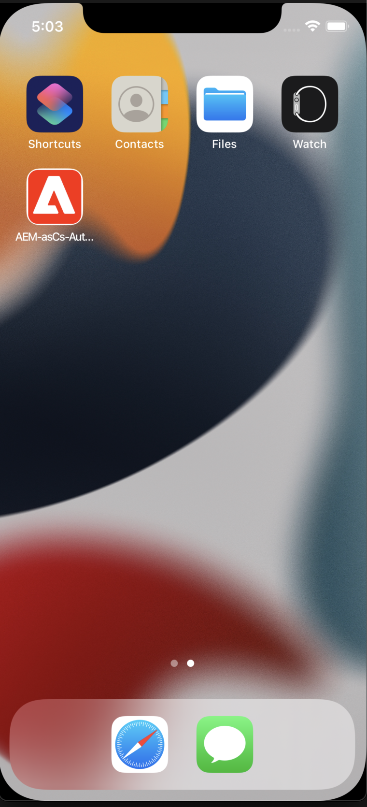
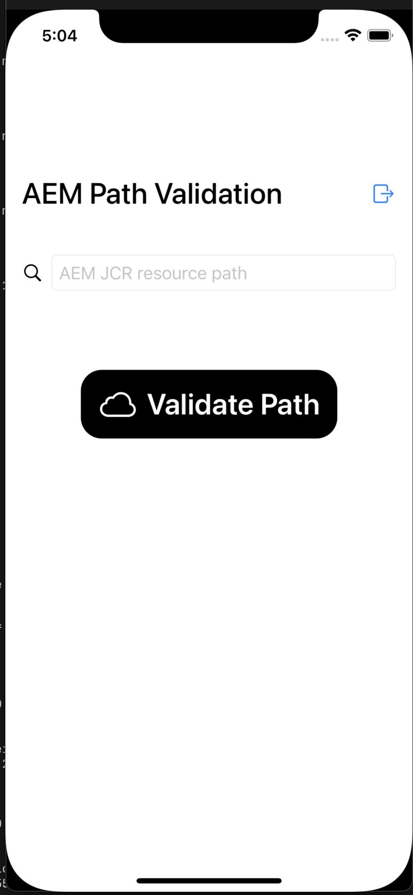
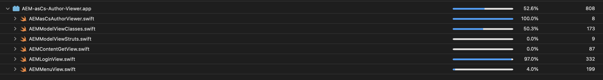

# AEM cloud sdk iOS app viewer

In this repo you will find an AEM author cloud SDK viewer to fetch jcr content for a particular path
The following is the integration overview diagram of the implementation

Following are the app images from the iOS simulator
** App icon **

** App Login screenshot **

** App Home screenshot after a successful login **

** App Result page screenshot for an existing/valid jcr resource path **

The current code coverage for this version is 52%

